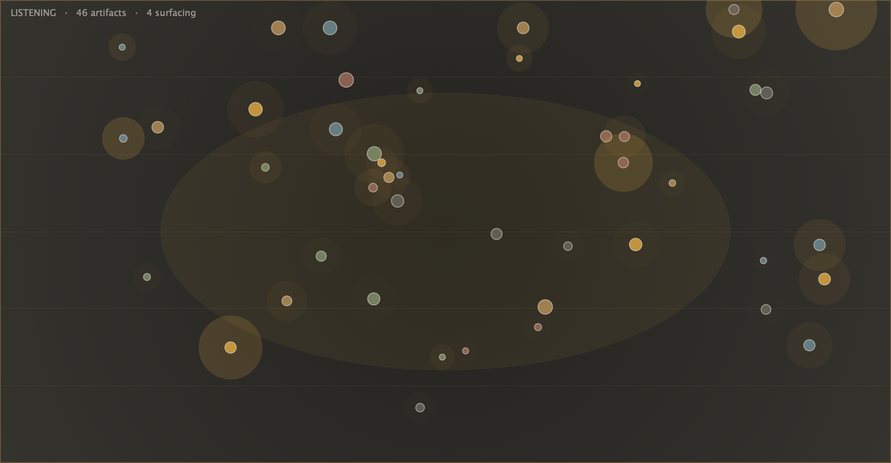

# Installing The Archaeologist (macOS)

No building required — grab the compiled universal build (Apple Silicon + Intel,
macOS 10.15+). Two ways: the **DMG** (easiest) or the **one-line installer**
(fastest for the plugins).



> ⚠️ **These builds are not code-signed or notarized.** macOS Gatekeeper will
> warn or block them on first use. That's expected for a free, open-source build
> — the steps below clear it. (If you'd rather trust nothing you didn't compile,
> [build from source](README.md#build) instead — it's a two-line CMake build.)

---

## Option A — DMG (recommended for non-technical friends)

1. Download **`TheArchaeologist-v0.1.0-macOS-universal.dmg`** from the
   [latest release](https://github.com/larrymarmalade/the-archaeologist/releases/latest).
2. Double-click it to open the disk image. You'll see the app, the two plugins,
   a `READ ME FIRST.txt`, and an **Applications** shortcut.
3. **Standalone app:** drag **The Archaeologist.app** onto **Applications**.
4. **Plugins** (copy into your user plugin folders — in Finder use the **Go**
   menu, hold **⌥ Option**, choose **Library**, then open `Audio/Plug-Ins`):
   - `The Archaeologist.vst3` → `~/Library/Audio/Plug-Ins/VST3/`
   - `The Archaeologist.component` → `~/Library/Audio/Plug-Ins/Components/`
5. **First launch of the app:** right-click **The Archaeologist.app** →
   **Open** → **Open** (a normal double-click will be blocked the first time).
6. **If a plugin won't load in your DAW**, clear the quarantine flag — see
   [Gatekeeper](#clearing-gatekeeper-quarantine) below.

---

## Option B — one-line installer (plugins only)

Installs both the **VST3** and **AU** into your user plugin folders and clears
the quarantine flag in one go. Paste into **Terminal**:

```bash
cd "$(mktemp -d)" && \
curl -L -o arch.zip "https://github.com/larrymarmalade/the-archaeologist/releases/download/v0.1.0/TheArchaeologist-v0.1.0-macOS-universal.zip" && \
unzip -q arch.zip && \
mkdir -p ~/Library/Audio/Plug-Ins/VST3 ~/Library/Audio/Plug-Ins/Components && \
cp -R TheArchaeologist/"The Archaeologist.vst3" ~/Library/Audio/Plug-Ins/VST3/ && \
cp -R TheArchaeologist/"The Archaeologist.component" ~/Library/Audio/Plug-Ins/Components/ && \
xattr -dr com.apple.quarantine ~/Library/Audio/Plug-Ins/VST3/"The Archaeologist.vst3" ~/Library/Audio/Plug-Ins/Components/"The Archaeologist.component" && \
echo "Installed VST3 + AU. Rescan plugins in your DAW."
```

> The `.zip` also contains the Standalone app if you want it — drag
> `TheArchaeologist/The Archaeologist.app` to `/Applications`.

---

## Clearing Gatekeeper quarantine

If your DAW silently skips the plugin, or you see *"can't be opened because Apple
cannot check it for malicious software"*, remove the download quarantine flag:

```bash
xattr -dr com.apple.quarantine ~/Library/Audio/Plug-Ins/VST3/"The Archaeologist.vst3"
xattr -dr com.apple.quarantine ~/Library/Audio/Plug-Ins/Components/"The Archaeologist.component"
```

For the standalone app: right-click it → **Open** → **Open** (only needed once).

---

## After installing

Rescan/restart your DAW so it picks up the new plugins:

- **Logic Pro** — AU only; it runs an AU validation scan on next launch. If it
  doesn't appear, run `auval -a | grep -i archaeolog` in Terminal to confirm
  macOS sees it.
- **Ableton Live / Reaper / Bitwig / Cubase** — enable the VST3 plugin folder in
  preferences and rescan.

Then insert it on a track, play for ~20–30 seconds, and hit **Dig Now**. See the
[Quick start](README.md#quick-start-musical) for a musical walkthrough.

## Uninstalling

```bash
rm -rf ~/Library/Audio/Plug-Ins/VST3/"The Archaeologist.vst3"
rm -rf ~/Library/Audio/Plug-Ins/Components/"The Archaeologist.component"
rm -rf /Applications/"The Archaeologist.app"
```

---

*Windows: not distributed as a binary yet. CI confirms it compiles under MSVC —
[build from source](README.md#build).*
